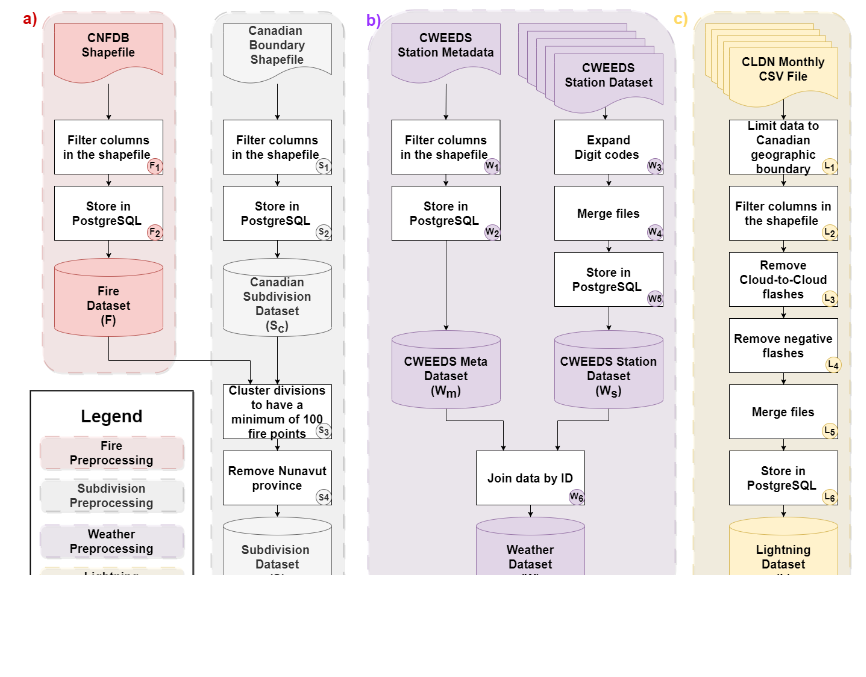

# A Federated Learning Framework based on Spatio-Temporal Agnostic Subsampling (STAS) for Forest Fire Prediction

This repository contains code associated with the paper titled "[A Federated Learning Framework based on Spatio-Temporal Agnostic Subsampling (STAS) for Forest Fire Prediction](https://ieeexplore.ieee.org/document/10633472)" presented in [IEEE 48th Annual Computers, Software, and Applications Conference (COMPSAC)](https://ieeecompsac.computer.org/2024/) at the Nakanoshima Center in Osaka University, Osaka, Japan.


## Data 

The data for modelling in this project is collated from multiple sources (multi-source data).
The data used in this research is available as follows:
|Name                                               | Provider | Short Name | Link                                                                                                         |
|---------------------------------------------------|----------|------------|--------------------------------------------------------------------------------------------------------------|
| Canadian National Fire Database                   | NRCan    | CNFDB      | [Source](http://cwfis.cfs.nrcan.gc.ca/datamart)                                                              |
| Census Boundary File                              | StatCan  | CBS        | [Source](https://www12.statcan.gc.ca/census-recensement/2021/geo/sip-pis/boundary-limites/index-eng.cfm)     |
| Canadian Weather Energy and Engineering Dataset   | ECCC     | CWEEDS     | [Source](https://open.canada.ca/data/en/dataset/005494f2-1848-48d5-abe4-a76a7846f035)                        |
| Canadian Lightning Detection Network              | ECCC     | CLDN       | Needs Approval                                                                                               |

The work flow for the preprocessing is given in the figure below


The code for preprocessing is available in notebooks > [data_preprocessing](notebooks/data_preprocessing).


## License

Licensing details are provided [here](LICENSE).
You are NOT allowed to make any unauthorized copy of the code


## Contact

If you have any questions, please get in touch with us at: mutakabbir@cmail.carleton.ca.
Use of your official email is needed due to spam filtering.
The subject should be "COMPSAC24 - <Query>" where the "<Query>" is a short description of the question you have.


## Citation / Referencing 

```
@INPROCEEDINGS{mutakabbir2024compsac,
  author={Mutakabbir, Abdul and Lung, Chung-Horng and Ajila, Samuel A. and Naik, Kshirasagar and Zaman, Marzia and Purcell, Richard and Sampalli, Srinivas and Ravichandran, Thambirajah},
  booktitle={IEEE 48th Annual Computers, Software, and Applications Conference (COMPSAC)}, 
  title={A Federated Learning Framework Based on Spatio-Temporal Agnostic Subsampling (STAS) for Forest Fire Prediction}, 
  year={2024},
  pages={350-359},
  doi={10.1109/COMPSAC61105.2024.00056}
}
```
